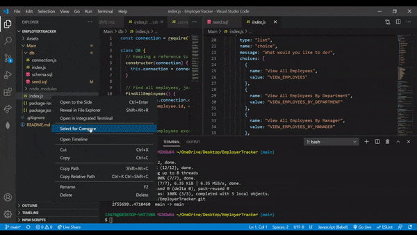

#  Employee Tracker

This app works on interfaces known as **C**ontent **M**anagement **S**ystems ,managing a company's employees using node, inquirer, and MySQL.

## About Database 

Database schema contains three tables:

* **department**:

  * **id** - INT PRIMARY KEY
  * **name** - VARCHAR(30) to hold department name

* **role**:

  * **id** - INT PRIMARY KEY
  * **title** -  VARCHAR(30) to hold role title
  * **salary** -  DECIMAL to hold role salary
  * **department_id** -  INT to hold reference to department role belongs to

* **employee**:

  * **id** - INT PRIMARY KEY
  * **first_name** - VARCHAR(30) to hold employee first name
  * **last_name** - VARCHAR(30) to hold employee last name
  * **role_id** - INT to hold reference to role employee has
  

## Technologies Used 

* MySQL
* Node
* npm Package 
* seed.sql ( pre-populate your database)
## Installation 

* run the following code after cloning the project onto the local to the terminal 
* **npm** - npm i 
  * **express** - npm i express
  * **mysql** - npm i mysql
  

